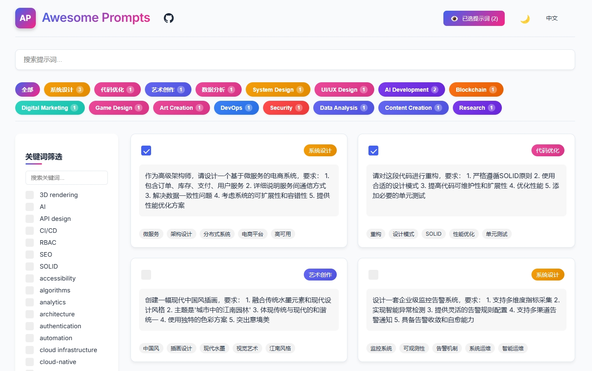

<div align="center">

# 🌟 Awesome Prompts



[](https://github.com/shalom-lab/awesome-prompt/stargazers)
[](https://github.com/shalom-lab/awesome-prompt/network)
[](https://github.com/shalom-lab/awesome-prompt/issues)
[](https://github.com/shalom-lab/awesome-prompt/blob/main/LICENSE)
[](https://github.com/shalom-lab/awesome-prompt/graphs/contributors)

An elegant prompt management and sharing platform to help you better manage and use AI prompts.

[English](./README.md) | [简体中文](./README.zh-CN.md) | [Live Demo](https://shalom-lab.github.io/awesome-prompt/) | [Report Bug](https://github.com/shalom-lab/awesome-prompt/issues) | [Request Feature](https://github.com/shalom-lab/awesome-prompt/issues)

</div>

## 🎯 Overview

Awesome Prompts is a modern, feature-rich platform designed to help you manage and utilize AI prompts effectively. Whether you're a developer, designer, or content creator, our platform provides the tools you need to organize and leverage AI prompts for maximum productivity.

## ✨ Features

- 🎨 **Elegant UI** - Beautiful interface with light/dark theme support
- 🌍 **Internationalization** - Full support for English and Chinese
- 🏷️ **Smart Organization** - Category management and keyword filtering
- 📋 **Efficient Workflow** - One-click copy and export functionality
- 🔍 **Powerful Search** - Find the perfect prompt instantly
- 💾 **Batch Operations** - Export multiple prompts at once
- 🚀 **Modern Tech** - Built with Vue 3 + Vite for excellent performance

## 🖥 Quick Start

### Online Demo

Visit our [Live Demo](https://shalom-lab.github.io/awesome-prompt/) to try it out immediately!

### Local Development

```bash
# Clone the project
git clone https://github.com/shalom-lab/awesome-prompt.git

# Enter the project directory
cd awesome-prompt

# Install dependencies
npm install

# Start development server
npm run dev
```

## 🛠️ Tech Stack

- **Frontend Framework:** Vue 3
- **Build Tool:** Vite
- **State Management:** Vue Composition API
- **Styling:** CSS Variables
- **CI/CD:** GitHub Actions
- **Hosting:** GitHub Pages

## 🤝 Contributing

We welcome all contributions! Here's how you can help:

### Adding New Prompts

1. Add your prompts to `awesome_prompts.json`
2. Each prompt should include:
   - `prompt`: The actual prompt text
   - `category`: The category it belongs to
   - `keywords`: Array of relevant keywords
3. Submit a Pull Request

Example prompt format:
```json
{
  "prompt": "Your prompt text here",
  "category": "System Design",
  "keywords": ["keyword1", "keyword2"]
}
```

### Other Contributions

- Report bugs by creating issues
- Submit PRs to help solve issues or add features
- Improve documentation

## 📝 License

This project is licensed under the [MIT License](./LICENSE).

## 🙏 Acknowledgments

- Thanks to all our amazing contributors
- Special thanks to the [Vue.js](https://vuejs.org/) and [Vite](https://vitejs.dev/) teams
- Thanks to the open source community

---

<div align="center">

If this project helps you, please consider giving it a ⭐️

</div> 